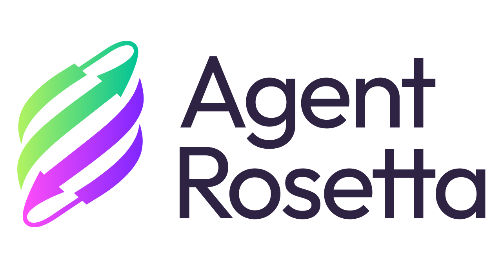

<p align="center">
    
</p>
<p align="center" width="100%">
    <a href="https://arxiv.org/pdf/2603.15952">paper</a>
</p>

An LLM agent to execute protein-design tasks with [RosettaScripts](https://docs.rosettacommons.org/docs/latest/scripting_documentation/RosettaScripts/RosettaScripts).

# Links

- Paper: [arXiv:2603.15952](https://arxiv.org/pdf/2603.15952)

# Code and Data Availability

Code and data are in preparation for release.

# Citation

If you find this project useful, please cite:

```bibtex
@article{teneggi2026protein,
  title={Protein Design with Agent Rosetta: A Case Study for Specialized Scientific Agents},
  author={Teneggi, Jacopo and Turzo, SM and Marwah, Tanya and Bietti, Alberto and Renfrew, P Douglas and Mulligan, Vikram Khipple and Golkar, Siavash},
  journal={arXiv preprint arXiv:2603.15952},
  year={2026}
}
```

# Acknowledgements

We thank Lucy Reading-Ikkanda and Aditya Chhatrala for their contribution to the artwork.


# License

This project is licensed under the [MIT License](LICENSE).